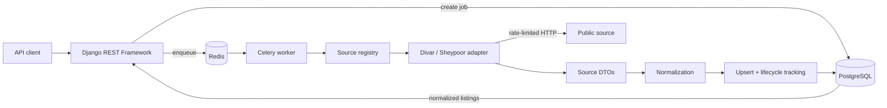

# CaspianCrawler

> A fault-tolerant Django backend for collecting, normalizing, deduplicating,
> and serving real-estate listings from public Iranian sources.

[](https://www.python.org/)
[](https://www.djangoproject.com/)
[](https://www.postgresql.org/)
[](LICENSE)

CaspianCrawler is a backend engineering project focused on the difficult parts of
aggregating real-estate data: source isolation, background processing, Persian
data normalization, conservative deduplication, listing lifecycle tracking, and
reliable third-party HTTP access. It currently targets **Mazandaran, Gilan, and
Golestan** and integrates with **Divar** and **Sheypoor**.

This is intentionally not a full marketplace. It is an API-first reference
implementation of a crawler platform whose components can be tested, operated,
and extended independently.


https://github.com/user-attachments/assets/86b4d23f-ae12-4fcc-a736-5608516b1456

<br>

## Highlights

- Source adapters for Divar's JSON API and Sheypoor's server-rendered Next.js data
- Observable asynchronous crawl jobs powered by Celery and Redis
- Persian/Arabic digit normalization, Jalali date conversion, and Toman/Rial handling
- Data-driven province, city, region, source-location, and category mappings
- Deterministic same-source upserts plus conservative cross-source duplicate review
- Evidence-based listing lifecycle: `active -> stale -> delisted`, without silent deletion
- Configurable timeouts, rate limits, bounded retries, exponential backoff, and `Retry-After`
- Searchable and filterable REST API with JWT authentication for operational endpoints
- Offline-by-default tests using saved source fixtures and mocked transports
- One-command local environment with Django, PostgreSQL, Redis, and a Celery worker

<br>

## Architecture



The boundaries are deliberate:

1. **Adapters** fetch and parse source-specific responses.
2. **Normalization** converts source DTOs into one source-independent listing shape.
3. **Crawl orchestration** owns job state, counters, failure reporting, and persistence.
4. **Deduplication** handles identity without contaminating parsing or API code.
5. **API views and serializers** remain thin and delegate domain work to services.

### Project layout

```text
config/settings/     Split development, test, and production settings
core/accounts/       User model and JWT endpoints
core/locations/      Province/city/region hierarchy and source mappings
core/sources/        Adapters, HTTP transport, policies, and rate limiting
core/normalization/  Pure source DTO -> normalized listing conversion
core/crawling/       Job models, orchestration, persistence, and Celery tasks
core/listings/       Listing model, read API, filtering, and lifecycle logic
core/dedup/          Cross-source matching and human review workflow
tests/               Unit, integration, and fixture-based crawler tests
compose/local/       Local Docker image and Compose stack
docs/                API request collection and presentation material
```

<br>

## Technology

| Area | Choice |
| --- | --- |
| Web/API | Django, Django REST Framework, django-filter |
| Operations admin | Django Unfold |
| Database | PostgreSQL |
| Background work | Celery with Redis broker/result backend |
| Crawling | HTTPX, Selectolax |
| Normalization | `jdatetime` plus project-specific pure functions |
| Authentication | Simple JWT |
| API schema | drf-spectacular, enabled only in development |
| Testing | pytest, pytest-django, RESPX, fakeredis, freezegun |
| Packaging | uv |
| Local deployment | Docker Compose |

HTTPX is used through its synchronous client: Celery supplies job-level
concurrency, while HTTP requests remain deliberately paced. Playwright is
available as tooling for future sources that genuinely require a browser, but
neither current adapter uses it and there is no automatic browser fallback.

<br>

## Quick start with Docker Compose

### Prerequisites

- Docker Engine with the Compose plugin
- Git

```bash
cp .env.example .env
```

Choose local values for at least `SECRET_KEY` and `POSTGRES_PASSWORD` in
`.env`, then start the stack:

```bash
docker compose --env-file .env -f compose/local/docker-compose.yml up --build
```

The stack starts PostgreSQL, Redis, Django, and a Celery worker. A one-shot
setup container applies migrations and idempotently seeds locations and source
categories before the application starts.

| Service | Local address |
| --- | --- |
| API | `http://127.0.0.1:8000/` |
| Django admin | `http://127.0.0.1:8000/admin/` |
| Swagger UI | `http://127.0.0.1:8000/api/docs/` |
| ReDoc | `http://127.0.0.1:8000/api/redoc/` |

The schema and documentation routes exist only while `DEBUG=True`; they are not
registered by the production URL configuration.

The Django admin is an Unfold-based operations console. Its landing dashboard
shows listing availability, live and recently unsuccessful crawl jobs, pending
duplicate reviews, a seven-day crawl outcome trend, and the eight most recent
jobs. Widgets and navigation entries follow Django model permissions, and the
header includes Persian/English and light/dark switches. The dashboard is
read-only: starting or re-running crawls remains an explicit API or admin action.

Useful Compose commands:

```bash
# Follow application and worker logs
docker compose --env-file .env -f compose/local/docker-compose.yml logs -f backend worker

# Run a management command
docker compose --env-file .env -f compose/local/docker-compose.yml exec backend \
  python manage.py createsuperuser

# Enable the optional scheduler profile
docker compose --env-file .env -f compose/local/docker-compose.yml \
  --profile scheduler up --build

# Stop while retaining database and Redis volumes
docker compose --env-file .env -f compose/local/docker-compose.yml down

# Destructive: also remove local database and Redis data
docker compose --env-file .env -f compose/local/docker-compose.yml down --volumes
```

The local stack uses Django's development server and is not intended to be
exposed publicly.

<br>

## Native development setup

The repository pins Python 3.14 in `.python-version` and supports Python 3.13+.
You also need PostgreSQL, Redis, and [uv](https://docs.astral.sh/uv/).

```bash
uv sync
cp .env.example .env
```

Create a PostgreSQL database and role matching `.env`. Grant the role
`CREATEDB` if it will run the pytest-django database tests. Then initialize the
application:

```bash
uv run python manage.py migrate
uv run python manage.py seed_locations
uv run python manage.py seed_source_categories
uv run python manage.py createsuperuser
```

Run the API and worker in separate terminals:

```bash
uv run python manage.py runserver
uv run celery -A config worker -l info
```

Celery Beat is optional. It dispatches enabled `CrawlSchedule` rows and runs
lifecycle/deduplication maintenance tasks only when explicitly enabled:

```bash
CELERY_BEAT_ENABLED=true uv run celery -A config beat -l info
```

No crawl schedules are seeded, so a fresh installation does not begin making
requests to third-party sites on its own.

<br>

## API overview

Listing and location reads are public. Crawl-job creation and inspection
require a JWT. Ordinary users see only their own jobs; staff users can inspect
all jobs.

| Method | Endpoint | Purpose |
| --- | --- | --- |
| `POST` | `/auth/token/` | Obtain access and refresh tokens |
| `POST` | `/auth/token/refresh/` | Refresh an access token |
| `POST` | `/auth/token/verify/` | Verify a token |
| `GET` | `/api/crawl-options/` | List supported sources and normalized choices |
| `GET` | `/api/locations/provinces/` | List seeded provinces |
| `GET` | `/api/locations/cities/?province=<id>` | List cities, optionally by province |
| `GET` | `/api/locations/regions/?city=<id>` | List regions, optionally by city |
| `GET` | `/api/crawl-jobs/` | List visible crawl jobs |
| `POST` | `/api/crawl-jobs/` | Validate, create, and enqueue a crawl job |
| `GET` | `/api/crawl-jobs/<id>/` | Inspect status, counters, report, and event history |
| `GET` | `/api/listings/` | Search and filter normalized active listings |
| `GET` | `/api/listings/<id>/` | Retrieve one normalized listing |

### Typical workflow

For a guided tour of the complete workflow—including authentication, source and
location selection, crawl-job monitoring, listing filters, reruns, lifecycle
visibility, and error cases—import the
[`docs/httpie-collection.postman.json`](docs/httpie-collection.postman.json)
collection into HTTPie Desktop or Postman. The examples below show the minimal
flow without requiring either application.

First obtain a token:

```bash
curl -X POST http://127.0.0.1:8000/auth/token/ \
  -H 'Content-Type: application/json' \
  -d '{"username":"operator","password":"your-password"}'
```

Use the location endpoints to obtain a real seeded ID, then create a crawl job.
The scope must contain exactly one of `province_id`, `city_id`, or `region_id`:

```bash
curl -X POST http://127.0.0.1:8000/api/crawl-jobs/ \
  -H 'Authorization: JWT <access-token>' \
  -H 'Content-Type: application/json' \
  -d '{
    "source": "divar",
    "transaction_type": "sale",
    "property_type": "apartment",
    "page_limit": 2,
    "scope": {"city_id": <city-id>}
  }'
```

The response is returned after the job has been persisted and queued—not after
the crawl has completed. Poll `/api/crawl-jobs/<id>/`, then query listings:

```bash
curl 'http://127.0.0.1:8000/api/listings/?source=divar&transaction_type=sale&property_type=apartment&city=<city-id>&ordering=-published_at'
```

Supported listing filters include source, transaction/property type, location,
status, negotiable price, area ranges, and sale/deposit/rent ranges. `search`
matches title and description; `ordering` supports publication/observation
timestamps, area, and price fields. Anonymous users always see only active
listings. Staff users can inspect non-active lifecycle states.

<br>

## Crawling and source integrations

Only publicly accessible data is targeted. CaspianCrawler does not bypass
authentication, CAPTCHAs, access controls, or anti-bot mechanisms, and it does
not extract private or masked contact information.

### Divar

Divar's public web application consumes structured JSON endpoints. The adapter
uses the current `/v8/` listing-search and detail endpoints, follows cursor
pagination, and sends the category in the same request shape used by the web
client. Older `/v5/` endpoints returned `403` during investigation and are not
used. This integration is implemented as direct HTTP + JSON parsing; it does
not launch a browser.

### Sheypoor

Sheypoor serves listing pages as HTML containing a Next.js React Flight stream.
The adapter requests the public `/s/<slug>` pages, reconstructs the embedded
row graph, resolves its references, and converts the result into source DTOs.
Detail URLs must include their discovered slug because ID-only URLs return
`404`. Routes disallowed by the site's robots policy are not requested. This
integration also uses direct HTTP and requires no browser.

Source-specific parsing stops at the adapter boundary. Adding another source
means implementing `SourceAdapter`, registering it in `core/sources/registry.py`,
and adding source/location/category reference data; the crawl runner,
normalization contract, persistence, and API do not need to be rewritten.

<br>

## Normalization

Adapters preserve source values in DTOs; `core/normalization/` owns semantic
conversion and returns an immutable `NormalizedListing` before persistence.
The layer has no HTTP or database writes, keeping its highest-risk rules easy to
unit-test.

- Persian and Arabic-Indic digits are converted before numeric parsing.
- Arabic/Persian letter variants and invisible characters are folded for matching.
- Money is stored canonically in **Toman**; Rial values are divided by ten.
- Missing/negotiable prices remain `NULL` with an explicit flag—never a fake zero.
- Jalali and naive Tehran timestamps become timezone-aware Gregorian UTC values.
- Source categories map to shared transaction and property enums.
- Location identifiers and aliases resolve against seeded province/city/region data.
- Unreadable or absent values remain unknown instead of being guessed.

The latest raw source payload is retained for diagnostics, but the public API
exposes only the normalized representation.

<br>

## Identity and deduplication

CaspianCrawler separates two different problems:

**Same-source identity.** A database constraint on `(source, source_id)` defines
the durable identity of a listing. Seeing the same source identifier again
updates its normalized fields and `last_seen_at`; it does not create another
row. URLs are not used as identity because they can change.

**Cross-source similarity.** Listings from different sources are never merged
automatically. A pure matcher considers compatible location, transaction, and
property data, then scores area, headline price, normalized title tokens, and
publication proximity. Strong matches become `DuplicateCandidate` records for
human review. Confirming a candidate records a `duplicate_of` relationship;
both listings and their histories remain intact.

This conservative design prefers a visible possible duplicate over a
false-positive merge that destroys provenance.

<br>

## Background jobs and failure handling

An API request creates a `CrawlJob`, snapshots its resolved source scope, moves
it to `queued`, and publishes its ID to Celery. A worker atomically claims it
with `SELECT ... FOR UPDATE SKIP LOCKED`, preventing concurrent execution and
making redelivered messages safe no-ops.

```text
pending -> queued -> running -> succeeded
                            |-> partially_succeeded
                            |-> failed
                            `-> cancelled
```

Each transition creates an append-only `CrawlJobEvent`. Jobs expose page,
listing, skip, update, and error counters plus a bounded final report. If a
crawl persists useful data before a later page or detail fails, its final state
is `partially_succeeded` rather than losing that distinction as a generic
failure.

Celery was chosen because crawling is long-running and must not hold an HTTP
connection open. Redis already serves as the shared rate-limit store, so using
it as broker and result backend avoids introducing another service.

<br>

## Fault tolerance and rate limiting

All adapters share `core/sources/transport.py`, so new integrations inherit the
same reliability policy:

- Total and connection timeouts on every request
- At most four attempts by default
- Exponential backoff with jitter for transport failures, `408`, `425`, `429`, and `5xx`
- Explicit support for both forms of `Retry-After`, with a maximum accepted wait
- No automatic retry for permanent `4xx` responses such as `401`, `403`, or `404`
- Configurable response-size limits
- Per-source token buckets applied to initial attempts and retries
- Redis-backed shared pacing across workers in production

Defaults are intentionally conservative: approximately one request every two
seconds for Divar and every three seconds for Sheypoor. Every policy can be
overridden through environment variables without changing crawler code.

<br>

## Listing lifecycle

A listing is not deleted because one crawl did not find it. Completed,
meaningful crawl jobs are processed by the lifecycle sweep, and only listings
that were genuinely in that job's scope can accumulate a miss.

- One configured miss changes `active` to `stale`.
- Three configured misses change it to `delisted`.
- Reappearance resets the miss counter and reactivates the listing.
- `hidden` is a local operator decision and is never overwritten by crawling.
- Every status change is recorded in `ListingStatusEvent`.
- `CrawlJob.swept_at` prevents one crawl from charging the same miss twice.

Run a preview or a targeted sweep with:

```bash
uv run python manage.py sweep_listings --dry-run
uv run python manage.py sweep_listings --job-id <job-id>
```

Lifecycle mutation and duplicate review are intentionally operator/admin
workflows rather than public write endpoints.

<br>

## Configuration

Copy `.env.example` for the complete annotated list. The most important values
are:

| Variable | Purpose |
| --- | --- |
| `SECRET_KEY` | Required cryptographic secret in production |
| `DJANGO_SETTINGS_MODULE` | `development`, `test`, or `production` settings |
| `DJANGO_ALLOWED_HOSTS` | Comma-separated production hostnames |
| `DATABASE_URL` | PostgreSQL URL; alternative to individual `POSTGRES_*` values |
| `POSTGRES_*` | Database name, user, password, host, and port |
| `REDIS_URL` | Celery broker/results, cache, and shared rate-limit state |
| `CRAWL_USER_AGENT` | Crawler identity; production should include a contact |
| `CRAWL_RATE_LIMIT_BACKEND` | `memory` or `redis` |
| `CELERY_BEAT_ENABLED` | Enables periodic dispatch/maintenance entries |
| `LISTING_*` | Lifecycle thresholds and sweep behavior |
| `DEDUP_*` | Candidate detection schedule and comparison bounds |

Per-source policies use
`CRAWL_<SOURCE>_<SETTING>`, for example:

```dotenv
CRAWL_DIVAR_REQUESTS_PER_SECOND=0.25
CRAWL_DIVAR_MAX_ATTEMPTS=4
CRAWL_SHEYPOOR_TIMEOUT_SECONDS=30
CRAWL_SHEYPOOR_ENABLED=true
```

Supported settings include request rate, burst size, total/connect timeout,
attempt count, backoff parameters, maximum `Retry-After`, maximum response
size, and an enabled switch. Never commit a populated `.env`.

<br>

## Testing

```bash
uv run pytest
```

The default suite is fast and offline: network and browser markers are
deselected in `pyproject.toml`, Celery runs eagerly with an in-memory broker,
and retry tests use injected clocks instead of sleeping.

Coverage is organized by risk:

- **Unit tests:** Persian text/digits, money, dates, categories, locations, and duplicate scoring
- **Fixture-based tests:** Divar JSON and Sheypoor HTML/React Flight parsers
- **Transport tests:** timeouts, retries, backoff, `429`, `Retry-After`, and rate limiting
- **Integration tests:** job creation/status, listing search/filtering, reruns, lifecycle, and review services
- **Model/command tests:** constraints, seeds, scheduling, sweeping, and idempotent persistence

Optional live smoke checks are separate and never run in the default suite:

```bash
uv run pytest -m network
```

The `playwright` marker is reserved for future browser-dependent integrations;
the current adapters and test suite do not launch a browser.

The tests intentionally do not depend on live source content. Remote sites can
change or become unavailable, and automated CI should neither become flaky nor
generate unnecessary traffic.

<br>

## Production notes

`config/settings/production.py` requires secrets and database configuration
from the environment, defaults the shared rate limiter and Django cache to
Redis, and exposes no Swagger/ReDoc/schema routes. It includes proxy-aware TLS,
secure-cookie, HSTS, CORS, and static-file settings for a conventional Gunicorn
deployment behind a reverse proxy.

The Compose stack documented above is specifically for local development. A
production deployment should supply managed PostgreSQL/Redis or durable
volumes, a reverse proxy and TLS, secret management, health monitoring, and
separate web, worker, and optional beat processes.

<br>

## License

CaspianCrawler is available under the [Apache License 2.0](LICENSE).
